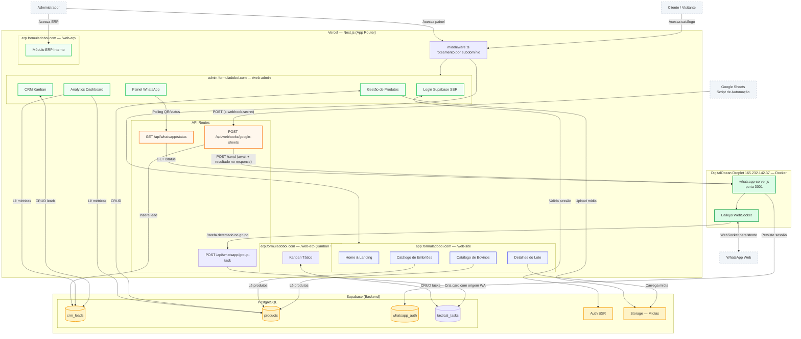

# Arquitetura — Fórmula do Boi

---

## Visão Geral

O sistema é composto por dois processos distintos:

1. **Next.js (Vercel)** — aplicação principal com três frontends em subdomínios distintos, roteados via middleware
2. **WhatsApp Server (Docker)** — microserviço Node.js dedicado à conexão persistente do Baileys com o WhatsApp Web

Ambos compartilham o mesmo banco **Supabase** (PostgreSQL).

---

## Diagrama de Serviços



---

## Fluxo de Automação de Leads

```
Google Sheets (novo lead)
        │
        │ POST /api/webhooks/google-sheets
        │ Header: x-webhook-secret
        ▼
  Next.js API Route
  ┌─────────────────────────────────┐
  │ 1. Valida secret                │
  │ 2. Normaliza campos (nome,      │
  │    data DD/MM/YYYY, telefone)   │
  │ 3. INSERT → crm_leads           │
  │ 4. await POST /send             │
  │    → captura { sent, reason,    │
  │      error } por lead           │
  │ 5. Retorna leads[] com status   │
  │    WhatsApp no response         │
  └─────────────────────────────────┘
        │
        ▼
  whatsapp-server.js
  ┌─────────────────────────────────┐
  │ 1. Formata número (+55)         │
  │ 2. onWhatsApp() → resolve JID   │
  │ 3. sendMessage(jid, texto)      │
  └─────────────────────────────────┘
        │
        ▼
  WhatsApp Web (mensagem entregue)
```

> **Nota sobre JID**: O `onWhatsApp()` do Baileys retorna o JID canônico do número, que pode diferir do número formatado (ex: números brasileiros com 8 vs 9 dígitos). O envio DEVE usar `result[0].jid` e não o número formatado diretamente.

---

## Sessão do WhatsApp

A sessão do Baileys (credenciais e chaves de criptografia) é persistida na tabela `whatsapp_auth` do Supabase, permitindo que o container reinicie sem perder a sessão autenticada.

**Conflito de sessão (erro 440):** o WhatsApp permite apenas uma instância ativa por número. Se um servidor local subir com as mesmas credenciais do Supabase, a sessão do VPS cai imediatamente com código 440. Nunca rodar o servidor local em paralelo com o VPS de produção.

**Para reconectar** (sessão expirada ou após conflito):
```bash
# 1. Limpar sessão via API REST do Supabase
curl -X DELETE \
  "https://hghtikjaqixglmpujbwj.supabase.co/rest/v1/whatsapp_auth?id=neq.null" \
  -H "apikey: <SUPABASE_SERVICE_ROLE_KEY>" \
  -H "Authorization: Bearer <SUPABASE_SERVICE_ROLE_KEY>"

# 2. O container reconecta automaticamente em até 5s e gera novo QR
# Acompanhar pelo painel: admin.formuladoboi.com/whatsapp
```

```bash
# Alternativa via SSH (se precisar ver o QR no terminal)
ssh root@165.232.142.37
docker restart formula_boi_whatsapp
docker logs -f formula_boi_whatsapp
```

---

## Roteamento por Subdomínio

`src/middleware.ts` intercepta todas as requisições e reescreve o path com base no hostname:

| Hostname | Rewrite para |
|---|---|
| `admin.*` | `/web-admin/*` |
| `erp.*` | `/web-erp/*` |
| qualquer outro | `/web-site/*` |

Na Vercel, cada domínio aponta para o mesmo deployment. O middleware faz o roteamento em runtime, sem builds separados.

---

## Banco de Dados (Supabase)

Tabelas principais:

| Tabela | Uso |
|---|---|
| `products` | Catálogo de bovinos (matrizes, reprodutores, embriões) |
| `crm_leads` | Leads do pipeline de vendas (status, responsável, histórico) |
| `whatsapp_auth` | Credenciais da sessão Baileys (chaves de criptografia) |

Migrations SQL em `/database/`.

---

## Infraestrutura de Produção

| Componente | Serviço | Detalhes |
|---|---|---|
| Next.js App | Vercel | Conta `masterjhony`, projeto `formula_do_boii` |
| WhatsApp Server | DigitalOcean Droplet | IP `165.232.142.37`, Ubuntu 24.04, 1GB RAM |
| Banco de Dados | Supabase | `hghtikjaqixglmpujbwj.supabase.co` |

### Acesso ao Droplet

```bash
ssh root@165.232.142.37
```

Arquivos do servidor em `/opt/whatsapp-server/`:
- `whatsapp-server.js` — código do servidor
- `package.json` — dependências
- `Dockerfile` — build da imagem
- `.env` — variáveis de ambiente (Supabase keys)

Container: `formula_boi_whatsapp`, porta `3001`, `restart: unless-stopped`.

### Acesso à Vercel

```bash
# Requer login prévio
vercel login

# Vincular repositório local
vercel link --scope joaos-projects-4fb95c65 --project formula_do_boii

# Gerenciar env vars, deployments, etc.
vercel env ls
vercel ls
```
